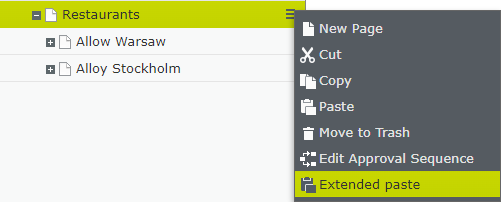
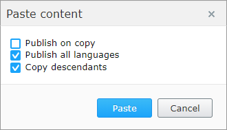
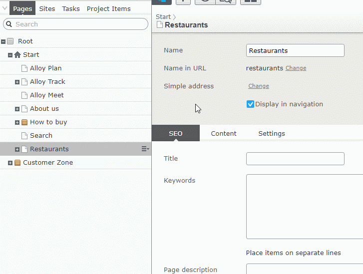

# extended-content-copy


Plugin that allows Editors to have better control when copy and paste content.

It allows to:
* keep version as draft instead of copying published version
* copy only master language of the page
* do not copy descendants of the page

The plugin can be used in two ways. We can either override the default behaviour of the paste command or we can show new “Extended paste” action in page tree context menu.

In `Command` this mode, when Editor copies a page, the new command "Extended paste" will be available after clicking the context menu of the destination page:


After clicking the command, the dialog with available options will be displayed



The copied page won’t be published nor translated. Also children of the page won't be copied.



## Options

Addon has few settings that are stored as Options. They define how extended paste behaves.

| Option        | Type    | Default           | Description  |
 | ---- | ---- | ---- | ---- |
 | Mode | Enum | Defines how plugin is working: <br/>off – plugin is not used <br/> command – new edit mode command is available <br/>auto – build-in paste command will automatically use configured paste options | Command |
 | AllowedPasteActions | AllowedActions | Defines what actions are active: PublishOnDestination, CopyAllLanguageBranches and CopyDescendants | PublishOnDestination, CopyAllLanguageBranches, CopyDescendants are true |
 | PasteDefaults | Defaults | Defines default action values | PublishOnDestination is false while CopyAllLanguageBranches and CopyDescendants are true |

Below you can find an example for configuring options:

````
[InitializableModule]
public class ExtendedContentCopyInitialization : IConfigurableModule
{
    public void ConfigureContainer(ServiceConfigurationContext context)
    {
        context.ConfigurationComplete += (o, e) =>
        {
            // override default behaviour and allow to copy descendants
            context.Services.Configure<ExtendedContentCopyOptions>(options =>
            {
                options.Mode = ExtendedContentCopyOptions.ExtendedContentCopyMode.Auto;
                options.AllowedPasteActions.CopyDescendants = true;
            });
        };
    }
 
    public void Initialize(InitializationEngine context) { }
 
    public void Uninitialize(InitializationEngine context) { }
 
    public void Preload(string[] parameters) { }
}
````

## Overriding default copy behaviour

When Mode is set to auto, the edit mode command is not available. Editor won’t be able to decide how copy should work, but instead it will depend on configured Defaults values.


## Nuget

HEre you can find [Nuget](https://nuget.optimizely.com/package/?id=ExtendedContentCopy) package.
